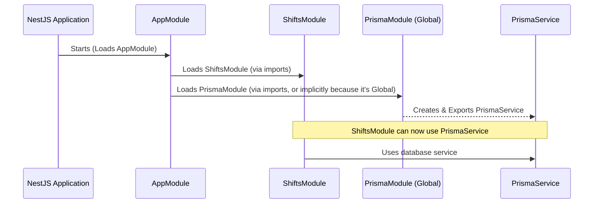

# Chapter 1: NestJS Modules

Welcome to your first step into the world of NestJS! If you've ever tried to build a web application, you know that as it grows, keeping your code organized can become a real challenge. Imagine you're building an online store. You'll have features for managing products, user accounts, shopping carts, and processing orders. If all the code for these features is jumbled together, it quickly becomes a tangled mess, hard to understand, and even harder to update.

This is where NestJS Modules come to the rescue!

## What Problem Do NestJS Modules Solve?

Think of building a large application like constructing a big office building. You wouldn't just have one giant room for everyone, right? You'd have different departments: Sales, HR, Engineering, Marketing, etc. Each department has its own specific tasks and responsibilities but can also work together.

NestJS modules are like these **departments for your application**. They help you group related pieces of your code – like user management, product features, or order processing – into distinct, organized units. This makes your application:

*   **More Organized:** Easy to find the code you're looking for.
*   **Easier to Maintain:** Changes in one "department" (module) are less likely to break another.
*   **Scalable:** As your application grows, you can add new "departments" (modules) without making the existing ones overly complex.

## What Exactly is a NestJS Module?

In NestJS, a module is a class annotated with the `@Module()` decorator. This decorator provides metadata that NestJS uses to organize the application structure.

A module can bundle:
*   **[NestJS Controllers](02_nestjs_controllers_.md):** These handle incoming web requests (like when a user visits a URL). Think of them as the receptionists or customer-facing staff of a department.
*   **[NestJS Services](04_nestjs_services_.md) (and other Providers):** These contain the actual business logic, calculations, or data manipulation. Think of them as the specialists and workers within a department doing the core tasks.
*   **Imports from other modules:** A module can use functionalities from other modules. For example, the "Orders Department" might need information from the "Products Department."
*   **Exports:** A module can make its own functionalities (usually services) available for other modules to use.

Let's look at a simple module structure:

```typescript
// A conceptual example: posts.module.ts
import { Module } from '@nestjs/common';
// import { PostsController } from './posts.controller'; // We'll cover this later!
// import { PostsService } from './posts.service';       // And this too!

@Module({
  // controllers: [PostsController], // List of controllers in this module
  // providers: [PostsService],    // List of services in this module
  // imports: [],                  // List of other modules this module uses
  // exports: [],                  // List of services this module shares
})
export class PostsModule {}
```
This `PostsModule` is currently a basic shell. The `@Module({...})` part is what tells NestJS, "Hey, this `PostsModule` class is a module with these characteristics!"

## The Root Module: `AppModule`

Every NestJS application has at least one module, called the **root module**. By convention, this is usually named `AppModule`. Think of the `AppModule` as the main headquarters of your company – it connects all the other departments (modules).

Let's look at the `AppModule` from our project:

```typescript
// File: src/app.module.ts
import { Global, Module } from "@nestjs/common";

import { PrismaModule } from "./modules/prisma/prisma.module";
import { ShiftsModule } from "./modules/shifts/shifts.module";
import { WorkersModule } from "./modules/workers/workers.module";
import { WorkplacesModule } from "./modules/workplaces/workplaces.module";

@Global() // We'll touch on @Global() soon
@Module({
  imports: [PrismaModule, ShiftsModule, WorkersModule, WorkplacesModule],
})
export class AppModule {}
```
*   `@Module({...})`: This decorator marks `AppModule` as a module.
*   `imports: [PrismaModule, ShiftsModule, WorkersModule, WorkplacesModule]`: This is crucial. It tells NestJS that our `AppModule` depends on (or uses) `PrismaModule`, `ShiftsModule`, `WorkersModule`, and `WorkplacesModule`. NestJS will ensure these modules are loaded and their exported functionalities are available.

## Feature Modules: Organizing by Functionality

Besides the root `AppModule`, you'll create **feature modules** to organize your code around specific features. For example, if you're building an application to manage employee shifts, you might have a `ShiftsModule`.

Let's peek into our `ShiftsModule`:

```typescript
// File: src/modules/shifts/shifts.module.ts
import { Module } from "@nestjs/common";

import { ShiftsController } from "./shifts.controller";
import { ShiftsService } from "./shifts.service";

@Module({
  controllers: [ShiftsController],
  providers: [ShiftsService],
})
export class ShiftsModule {}
```
*   `controllers: [ShiftsController]`: This tells NestJS that `ShiftsController` (which we'll explore in [NestJS Controllers](02_nestjs_controllers_.md)) belongs to this module and will handle requests related to shifts (e.g., `GET /shifts`).
*   `providers: [ShiftsService]`: This registers `ShiftsService` (which we'll explore in [NestJS Services](04_nestjs_services_.md)) within this module. This service will contain the logic for creating, reading, updating, and deleting shifts.

You can see similar structures in `WorkersModule` and `WorkplacesModule`, each dedicated to their respective functionalities.

## Sharing is Caring: `exports` and `@Global()` Modules

Sometimes, a module provides a utility or service that many other modules need. A common example is a database connection service. You wouldn't want to set up the database connection in every single module!

Instead, you create a dedicated module (like our `PrismaModule` for database interactions using [Prisma ORM](05_prisma_orm_.md)), make it provide the service, and then *export* that service.

```typescript
// File: src/modules/prisma/prisma.module.ts
import { Global, Module } from "@nestjs/common";

import { PrismaService } from "./prisma.service";

@Global() // Makes this module's exports available everywhere
@Module({
  providers: [PrismaService], // This module "provides" PrismaService
  exports: [PrismaService],   // This module "exports" PrismaService
})
export class PrismaModule {}
```
*   `providers: [PrismaService]`: The `PrismaModule` is responsible for creating and managing an instance of `PrismaService`.
*   `exports: [PrismaService]`: This is key! It means that any other module that *imports* `PrismaModule` can now use `PrismaService`.
*   `@Global()`: This is a special decorator. When a module is marked as `@Global()`, its exported providers (like `PrismaService` here) become available to *all other modules in the application* without needing to explicitly add `PrismaModule` to their `imports` array. This is convenient for universally needed services like database connections, configuration, or logging.

So, if `ShiftsModule` needs to talk to the database, it can use `PrismaService` because `PrismaModule` is global and exports it.

## How NestJS Puts It All Together (A Peek Under the Hood)

When your NestJS application starts, it doesn't just randomly run code. It follows a structured process, largely guided by your modules:

1.  **Start with the Root:** NestJS first looks at your main application entry point (usually `main.ts`), which bootstraps the `AppModule`.
2.  **Resolve Dependencies:** It reads the `imports` array of `AppModule`. For each imported module (e.g., `ShiftsModule`, `PrismaModule`), it goes and processes that module.
3.  **Instantiate Providers & Controllers:** Within each module, NestJS instantiates the classes listed in `providers` (like services) and `controllers`.
4.  **Link Exports:** If a module exports providers (like `PrismaModule` exporting `PrismaService`), those providers become available to the modules that imported it (or globally if `@Global()` is used).

This creates a graph of dependencies, ensuring everything is set up in the correct order.

Here's a simplified view of how modules might interact:



Essentially, the `@Module()` decorator and its properties (`imports`, `exports`, `controllers`, `providers`) are instructions for NestJS. They tell NestJS:
*   "These are the pieces that make up this part of the application."
*   "This part needs functionalities from these *other* parts."
*   "This part offers these functionalities to *other* parts."

This structured approach, defined by modules, is what makes NestJS powerful for building complex applications that remain organized and manageable.

## Conclusion

You've just taken your first look at NestJS Modules – the fundamental building blocks of any NestJS application!

We've learned that:
*   Modules help organize your application into logical, manageable units, much like departments in a company.
*   The `@Module()` decorator is used to define a module and its components.
*   Key properties of a module include `imports` (to use other modules), `controllers` (to handle requests), `providers` (for business logic), and `exports` (to share functionalities).
*   The `AppModule` is the root module that brings everything together.
*   Modules like `PrismaModule` can be made `@Global()` and `export` services to be used across the application.

Understanding modules is crucial because they form the backbone of your application's architecture. They dictate how different parts of your code are structured and how they interact.

In the next chapter, we'll zoom into one of the core components you list within a module: [NestJS Controllers](02_nestjs_controllers_.md). These are responsible for handling incoming requests and sending back responses.

---

Generated by [AI Codebase Knowledge Builder](https://github.com/The-Pocket/Tutorial-Codebase-Knowledge)