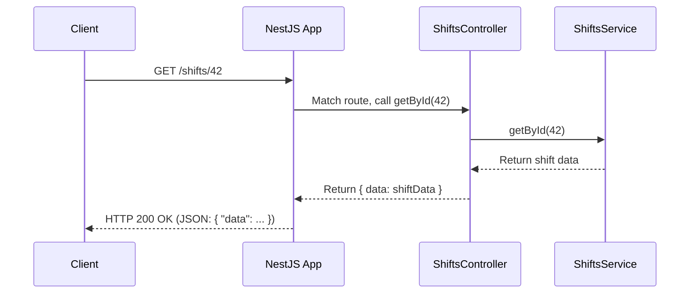

# Chapter 2: NestJS Controllers

Welcome back! In [Chapter 1: NestJS Modules](01_nestjs_modules_.md), we learned how NestJS uses modules to organize our application into manageable, feature-specific blocks, like departments in a company. We saw that modules can contain `controllers`. Now, let's dive into what these controllers actually do!

## The Front Desk: What Problem Do Controllers Solve?

Imagine you're building an API for managing employee shifts. Users will need to:
*   Get a list of all available shifts.
*   Get details for a specific shift.
*   Create a new shift.
*   Allow a worker to claim a shift.

When a user (or another program) sends a request to your application (e.g., by visiting a URL like `/shifts` or `/shifts/123`), how does your application know what code to run? How does it understand what the user wants to do?

This is where **NestJS Controllers** come in.

Controllers are like the **host or hostess at a restaurant**.
*   A **customer (client)** comes in with a **request** (e.g., "I'd like to see the menu for main courses" or "I'd like to place an order for a specific dish").
*   The **host/hostess (controller)** receives this request.
*   They understand the **purpose of the request** based on what the customer asked for (the URL path, like `/menu/main-courses`, and the action, like "view" or "order").
*   The host then **directs the request** to the appropriate staff (e.g., to the kitchen staff, which in NestJS terms would be a [NestJS Service](04_nestjs_services_.md)) to actually prepare the food or fetch the menu details.
*   Finally, a **response** (the menu, the prepared dish, or a confirmation) is given back to the customer.

So, controllers are responsible for:
1.  **Listening** for incoming requests at specific URL paths (endpoints).
2.  **Understanding** what kind of operation is requested (e.g., fetching data, creating data).
3.  **Delegating** the actual work (like database queries or complex calculations) to other parts of your application, typically [NestJS Services](04_nestjs_services_.md).
4.  **Sending back** an appropriate response to the client.

## What Does a Controller Look Like?

In NestJS, a controller is simply a TypeScript class decorated with the `@Controller()` decorator. This decorator tells NestJS that this class is meant to handle incoming requests.

Let's look at a simplified version of how we might define a controller for managing "shifts":

```typescript
// Conceptual example of a controller structure
import { Controller, Get, Post, Param, Body } from '@nestjs/common';

@Controller('shifts') // 1. Base path for this controller
export class ShiftsController {

  @Get() // 2. Handles GET requests to /shifts
  findAllShifts() {
    // Logic to get all shifts would go here (usually calls a service)
    return "Here are all the shifts!";
  }

  @Get(':id') // 3. Handles GET requests to /shifts/some_id
  findShiftById(@Param('id') id: string) { // 4. @Param extracts 'id'
    // Logic to get a specific shift by its ID
    return `Details for shift with ID: ${id}`;
  }

  @Post() // 5. Handles POST requests to /shifts
  createShift(@Body() shiftData: any) { // 6. @Body extracts request data
    // Logic to create a new shift using shiftData
    return { message: "Shift created!", data: shiftData };
  }
}
```

Let's break this down:

1.  `@Controller('shifts')`: This decorator marks `ShiftsController` as a controller. The string `'shifts'` means that this controller will handle requests that start with the `/shifts` path. For example, requests to `/shifts`, `/shifts/123`, or `/shifts/today` could all potentially be handled by this controller.

2.  `@Get()`: This is a **method decorator**. It tells NestJS that the `findAllShifts()` method should handle HTTP `GET` requests made to the base path of the controller (which is `/shifts` in this case). So, a `GET` request to `http://your-app.com/shifts` would trigger this method.

3.  `@Get(':id')`: This method decorator handles `GET` requests to a more specific path. The `:id` part is a **route parameter**. It means this method will handle requests like `/shifts/1`, `/shifts/abc`, etc. The actual value (`1` or `abc`) will be captured.

4.  `@Param('id') id: string`: This is a **parameter decorator** used inside the `findShiftById` method. It tells NestJS to extract the value of the `id` parameter from the URL path (e.g., `1` from `/shifts/1`) and make it available as the `id` variable within the method.

5.  `@Post()`: This method decorator means the `createShift()` method will handle HTTP `POST` requests to the controller's base path (`/shifts`). `POST` requests are typically used when the client wants to send data to the server to create a new resource.

6.  `@Body() shiftData: any`: This parameter decorator tells NestJS to extract the entire body of the incoming `POST` request and make it available as the `shiftData` variable. This is how your controller receives data from the client (e.g., details for a new shift to be created). We'll learn how to define the `any` type more strictly using [Data Schemas and Validation (Zod)](03_data_schemas_and_validation__zod_.md) in the next chapter.

## Our Project's Controllers

In our project, we have controllers for different features, just like we have different modules. For example, `ShiftsModule` has `ShiftsController`.

Let's look at a snippet from our actual `src/modules/shifts/shifts.controller.ts`:

```typescript
// File: src/modules/shifts/shifts.controller.ts (Simplified Snippet)
import { Controller, Get, Param, ParseIntPipe, Post, Body } from "@nestjs/common";
import { ShiftsService } from "./shifts.service"; // We'll cover services soon!
// ... other imports

@Controller("shifts")
export class ShiftsController {
  constructor(private readonly service: ShiftsService) {} // 1. Injecting the Service

  @Get("/:id") // 2. Route for getting a shift by ID
  async getById(@Param("id", ParseIntPipe) id: number) { // 3. Extracting and parsing ID
    const data = await this.service.getById(id); // 4. Delegating to the service
    // ... (error handling)
    return { data };
  }

  // ... other methods like create, get all, claim, cancel
}
```

1.  `constructor(private readonly service: ShiftsService)`: Remember how we said controllers delegate work? Here, the `ShiftsController` is set up to use `ShiftsService`. NestJS's dependency injection system automatically creates and provides an instance of `ShiftsService` to this controller. We'll explore [NestJS Services](04_nestjs_services_.md) in detail later. For now, just know the service is where the "real work" happens.

2.  `@Get("/:id")`: Just like our conceptual example, this defines a route to handle `GET` requests to paths like `/shifts/1`, `/shifts/25`, etc.

3.  `@Param("id", ParseIntPipe) id: number`: This is similar to `@Param('id')`, but with an addition: `ParseIntPipe`. This is a built-in NestJS "Pipe" that attempts to convert the `id` parameter (which is initially a string from the URL) into an integer. If it can't be converted (e.g., if the URL was `/shifts/abc`), NestJS would automatically return an error response.

4.  `const data = await this.service.getById(id);`: This is the crucial delegation step! The controller itself doesn't know how to fetch a shift from the database. It simply calls the `getById` method on the `ShiftsService`, passing along the `id`. The service will handle the logic (e.g., talking to the database via [Prisma ORM](05_prisma_orm_.md)) and return the data.

You'll find similar patterns in `src/modules/workers/workers.controller.ts` and `src/modules/workplaces/workplaces.controller.ts`. Each is focused on handling requests related to its specific domain (workers or workplaces).

For instance, to create a new shift, the `ShiftsController` has a method like this:
```typescript
// File: src/modules/shifts/shifts.controller.ts (Simplified Create Snippet)
// ...
import { CreateShift, /* ... */ } from "./shifts.schemas";
// ...

@Controller("shifts")
export class ShiftsController {
  constructor(private readonly service: ShiftsService) {}

  @Post() // Handles POST requests to /shifts
  // @UsePipes(...) // We'll discuss validation later
  async create(@Body() data: CreateShift) { // 'data' comes from the request body
    // 'CreateShift' is a type defining what 'data' should look like
    return { data: await this.service.create(data) }; // Delegate to service
  }
  // ...
}
```
Here, `@Body() data: CreateShift` means "take the JSON data sent in the body of the `POST` request, and expect it to match the structure of `CreateShift`." Then, this `data` is passed to `this.service.create(data)` for processing.

## How It Works: From Request to Response

Let's visualize the journey of a request:

1.  **Client Request:** A user's browser (or another application) sends an HTTP request, for example, `GET http://localhost:3000/shifts/42`.
2.  **NestJS Receives:** Your NestJS application, running on a server, receives this request.
3.  **Routing:** NestJS looks at the HTTP method (`GET`) and the path (`/shifts/42`).
    *   It first finds the controller registered for the base path `/shifts` (our `ShiftsController`).
    *   Then, within `ShiftsController`, it looks for a method handler that matches `GET` and the sub-path `/:id`. It finds the `getById` method.
4.  **Parameter Extraction:** NestJS sees `@Param("id", ParseIntPipe) id: number`.
    *   It extracts `"42"` from the URL.
    *   The `ParseIntPipe` converts `"42"` into the number `42`.
    *   This number `42` is passed as the `id` argument to the `getById` method.
5.  **Controller Method Execution:** The `getById(42)` method in `ShiftsController` is executed.
6.  **Service Delegation:** The controller calls `this.service.getById(42)`.
7.  **Business Logic:** The `ShiftsService` executes its logic (e.g., queries the database for shift with ID 42).
8.  **Service Returns:** The service returns the found shift data (or an error/null if not found) back to the controller.
9.  **Controller Responds:** The controller takes the data from the service and packages it into an object like `{ data: foundShift }`.
10. **NestJS Sends Response:** NestJS automatically converts this JavaScript object into a JSON string and sends it back to the client as an HTTP response with a `200 OK` status code (if successful).

Here's a simplified diagram:



## Recap: The Role of Controllers

*   **Entry Point:** Controllers are the first point of contact for requests matching their defined routes.
*   **Request Handlers:** They use decorators like `@Get()`, `@Post()`, `@Put()`, `@Delete()`, `@Patch()` to define which methods handle which HTTP verbs and URL paths.
*   **Data Extractors:** They use decorators like `@Param()`, `@Body()`, `@Query()`, `@Headers()` to extract data from various parts of the incoming request.
*   **Orchestrators, Not Workers:** Controllers typically don't contain complex business logic themselves. Their main job is to understand the request, extract necessary information, delegate the work to [NestJS Services](04_nestjs_services_.md), and then formulate a response based on what the service returns.
*   **Module-Bound:** As we saw in [Chapter 1: NestJS Modules](01_nestjs_modules_.md), controllers are declared within the `controllers` array of a module, making them part of that module's encapsulated scope.

For example, in `src/modules/shifts/shifts.module.ts`:
```typescript
// File: src/modules/shifts/shifts.module.ts
import { Module } from "@nestjs/common";
import { ShiftsController } from "./shifts.controller"; // Our controller
import { ShiftsService } from "./shifts.service";     // The service it uses

@Module({
  controllers: [ShiftsController], // Declaring the controller
  providers: [ShiftsService],      // Declaring the service
})
export class ShiftsModule {}
```
This tells NestJS that `ShiftsController` is part of `ShiftsModule` and is available to handle requests.

## Conclusion

You've now learned about NestJS Controllers – the crucial components that act as the "front door" for your API. They listen for incoming requests, figure out what needs to be done, pass the task to specialized services, and then send a response back to the client. Think of them as polite and efficient receptionists for your application's features.

We've seen how decorators like `@Controller()`, `@Get()`, `@Post()`, `@Param()`, and `@Body()` are used to define how controllers behave. We've also touched upon how they delegate the heavy lifting to services.

Now that we know how to receive requests and extract data (like the `shiftData` in our `createShift` example), a very important next step is to ensure that the data we receive is valid and in the correct format. What if the client sends incomplete or incorrect information for a new shift? That's where data validation comes in.

In the next chapter, we'll explore [Data Schemas and Validation (Zod)](03_data_schemas_and_validation__zod_.md) to see how we can define the expected shape of our data and validate incoming requests.

---

Generated by [AI Codebase Knowledge Builder](https://github.com/The-Pocket/Tutorial-Codebase-Knowledge)