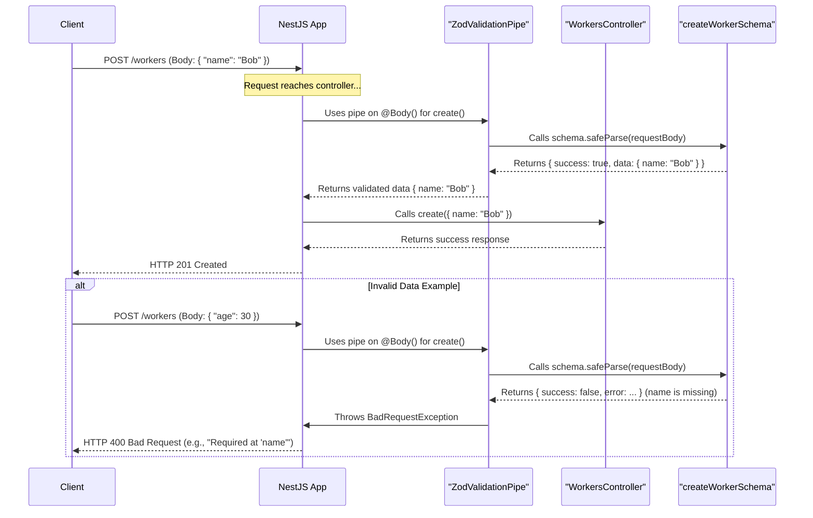

# Chapter 3: Data Schemas and Validation (Zod)

In [Chapter 2: NestJS Controllers](02_nestjs_controllers_.md), we learned how controllers act as the "front desk" for our application, receiving requests from users. When a user wants to create something new, like adding a new worker to our system, they send data (e.g., the worker's name). But how do we ensure this data is correct and complete before we try to save it? What if they forget the name, or send a number instead of text for the name? This could cause errors or lead to messy, unreliable data in our application.

This is where **Data Schemas and Validation** come into play!

## The Problem: Trusting Incoming Data

Imagine you're taking an order at a cafe. A customer wants to order a custom sandwich. You have a specific order form that lists required items: "Bread Type," "Main Filling," and optional items like "Cheese" or "Sauce."

*   **If the customer just says "I want a sandwich"**: You don't have enough information.
*   **If they say "I want a rye sandwich with turkey"**: That's good!
*   **If they say "I want a 'number 7' sandwich with 'lots of' cheese"**: "Number 7" might not be a valid bread type, and "lots of" isn't a specific cheese.

In our web application, when a client (like a web browser or another program) sends data to create a new "Worker," we need a similar "order form" to define what information is expected and in what format.

**Data Schemas** are these "order forms." They define:
*   The **structure** of the data (e.g., we expect an object).
*   The **fields** it should contain (e.g., a `name` field).
*   The **type** of each field (e.g., `name` must be text/string).
*   Any **constraints** or rules (e.g., `name` cannot be empty, or an `age` must be a positive number).

**Validation** is the process of checking the incoming data against this schema. If the data matches the schema, great! If not, we reject it and tell the client what was wrong.

This helps us:
*   Prevent errors down the line.
*   Maintain data integrity (keep our data clean and reliable).
*   Provide clear feedback to users if they submit incorrect data.

## Meet Zod: Our Schema Helper

In this project, we use a fantastic library called **Zod** to create these schemas and perform validation. Zod allows us to define schemas in a very clear and expressive way using TypeScript.

Think of Zod as a very precise assistant who helps you create these "order forms" and then checks every incoming order against them.

## Defining a Schema with Zod

Let's say we want to define the "order form" (schema) for creating a new worker. We expect the worker to have a `name`, which must be a piece of text (a string).

Here's how we can define this using Zod in our project:

```typescript
// File: src/modules/workers/workers.schemas.ts
import { z } from "zod"; // 1. Import Zod

// 2. Define the schema for creating a worker
export const createWorkerSchema = z.object({
  name: z.string(), // 3. 'name' must be a string
});

// 4. Create a TypeScript type from the schema
export type CreateWorker = z.infer<typeof createWorkerSchema>;
```

Let's break this down:
1.  `import { z } from "zod";`: We import the `zod` library, commonly referred to as `z`.
2.  `export const createWorkerSchema = z.object({...});`: We're creating a schema for an object. This means we expect the incoming data to be a JSON object.
3.  `name: z.string()`: Inside the object, we define a field called `name`. `z.string()` tells Zod that the value for `name` must be a string (text). If it's a number, or missing, Zod will consider it invalid.
4.  `export type CreateWorker = z.infer<typeof createWorkerSchema>;`: This is a neat Zod feature! It automatically creates a TypeScript `type` called `CreateWorker` based on our `createWorkerSchema`. So, `CreateWorker` will be `{ name: string }`. This helps us write type-safe code in our controllers and services.

Now we have a `createWorkerSchema` that clearly states: "To create a worker, you must provide an object with a `name` property, and that `name` must be a string."

## Using the Schema: The `ZodValidationPipe`

Okay, we have our schema. How do we actually use it to check incoming data in our [NestJS Controllers](02_nestjs_controllers_.md)?

NestJS has a concept called **Pipes**. A pipe is a class that can transform or validate data passed to a controller's route handler method. We've created a custom pipe called `ZodValidationPipe` that uses our Zod schemas.

Here's a simplified look at our `ZodValidationPipe`:

```typescript
// File: src/pipes/zod-validation-pipe.ts (Simplified)
import { BadRequestException, PipeTransform } from "@nestjs/common";
import { ZodSchema } from "zod";

export class ZodValidationPipe implements PipeTransform {
  constructor(private schema: ZodSchema) {} // 1. Takes a Zod schema

  transform(value: unknown) { // 2. 'value' is the incoming data
    const result = this.schema.safeParse(value); // 3. Try to validate

    if (result.success) {
      return result.data; // 4. If valid, return the (potentially transformed) data
    }

    // 5. If invalid, throw an error
    const issue = result.error.issues[0];
    throw new BadRequestException(
      issue ? `${issue.message}: '${issue.path.join(".")}'` : "Validation failed"
    );
  }
}
```
1.  `constructor(private schema: ZodSchema)`: When we use this pipe, we'll give it the specific Zod schema we want to validate against (e.g., our `createWorkerSchema`).
2.  `transform(value: unknown)`: NestJS will automatically call this `transform` method, passing the incoming request data (e.g., the request body) as the `value`.
3.  `this.schema.safeParse(value)`: This is the core Zod magic! It takes the incoming `value` and tries to check if it matches the `schema` provided in the constructor. `safeParse` doesn't throw an error itself; instead, it returns an object indicating success or failure.
4.  `if (result.success) { return result.data; }`: If `safeParse` reports success, it means the data is valid! The pipe returns `result.data` (the validated, and sometimes slightly transformed, data), which then gets passed to our controller method.
5.  `throw new BadRequestException(...)`: If `safeParse` reports an error (meaning the data doesn't match the schema), the pipe throws a `BadRequestException`. NestJS automatically catches this exception and sends a `400 Bad Request` HTTP error response back to the client, usually with a message explaining what went wrong (e.g., "Expected string, received number at 'name'").

## Applying Validation in a Controller

Now let's see how to use this `ZodValidationPipe` with our `createWorkerSchema` in a controller. Remember the `@Body()` decorator from [Chapter 2: NestJS Controllers](02_nestjs_controllers_.md) that extracts the request body? We can combine it with our pipe.

```typescript
// In a controller, e.g., src/modules/workers/workers.controller.ts
import { Body, Controller, Post } from '@nestjs/common';
import { CreateWorker, createWorkerSchema } from './workers.schemas';
import { ZodValidationPipe } from '../../pipes/zod-validation-pipe';
// ... import WorkersService

@Controller('workers')
export class WorkersController {
  // constructor(private readonly workersService: WorkersService) {}

  @Post() // Handles POST requests to /workers
  async create(
    // Apply the ZodValidationPipe to the request body
    @Body(new ZodValidationPipe(createWorkerSchema)) data: CreateWorker
  ) {
    // If code execution reaches here, 'data' is VALID and
    // TypeScript knows 'data' is of type CreateWorker (e.g., { name: string })

    console.log("Worker data received:", data);
    // return this.workersService.create(data); // Pass to service
    return { message: "Worker created successfully!", worker: data };
  }
}
```
Look at the `create` method's parameter:
`@Body(new ZodValidationPipe(createWorkerSchema)) data: CreateWorker`

*   `@Body(...)`: Tells NestJS to get the data from the request body.
*   `new ZodValidationPipe(createWorkerSchema)`: We create an instance of our validation pipe and pass it the `createWorkerSchema` we defined earlier. This tells the pipe: "Hey, use *this specific schema* to validate the body."
*   `data: CreateWorker`: If validation passes, the `data` variable will contain the validated data, and TypeScript will know its type is `CreateWorker` (thanks to Zod's `z.infer`).

**What happens now?**

*   **Valid Request:**
    *   Client sends: `POST /workers` with body `{"name": "Alice"}`
    *   `ZodValidationPipe` uses `createWorkerSchema` to check `{name: "Alice"}`.
    *   `name` is a string, so it's valid!
    *   The `create` method in `WorkersController` runs. The `data` variable will be `{name: "Alice"}`.
    *   Output: `Worker data received: { name: 'Alice' }` and then the success response.

*   **Invalid Request (e.g., wrong type):**
    *   Client sends: `POST /workers` with body `{"name": 123}`
    *   `ZodValidationPipe` checks `{name: 123}` against `createWorkerSchema`.
    *   `createWorkerSchema` expects `name` to be a string, but it received a number (123). Validation fails!
    *   `ZodValidationPipe` throws a `BadRequestException`.
    *   The `create` method in `WorkersController` **does not run**.
    *   NestJS sends back a `400 Bad Request` error to the client, possibly with a message like "Expected string, received number at 'name'".

*   **Invalid Request (e.g., missing field):**
    *   Client sends: `POST /workers` with body `{}` (empty object)
    *   `ZodValidationPipe` checks `{}`.
    *   `createWorkerSchema` requires a `name` field. It's missing. Validation fails!
    *   `ZodValidationPipe` throws a `BadRequestException`.
    *   The `create` method **does not run**.
    *   NestJS sends back a `400 Bad Request` error, possibly like "Required at 'name'".

## How Validation Works: A Peek Under the Hood

Let's trace the journey of a request with validation:



The `ZodValidationPipe` acts as a guard. Only data that passes its inspection (based on the Zod schema) gets through to your controller's logic.

## More Complex Schemas

Zod is very powerful. Our `createWorkerSchema` was simple. Let's look at a slightly more complex one, `createWorkplaceSchema` from `src/modules/workplaces/workplaces.schemas.ts`:

```typescript
// File: src/modules/workplaces/workplaces.schemas.ts (Snippet)
import { z } from "zod";
import { MAX_SHARDS } from "../shared/constants"; // A constant, e.g., 63

export const createWorkplaceSchema = z.object({
  name: z.string(), // 'name' must be a string
  shard: z.number().int().min(0).max(MAX_SHARDS).optional(), // 'shard' is more complex
});
```
Here, for the `shard` field:
*   `z.number()`: It must be a number.
*   `.int()`: It must be an integer (no decimals).
*   `.min(0)`: It must be 0 or greater.
*   `.max(MAX_SHARDS)`: It must be less than or equal to `MAX_SHARDS` (e.g., 63).
*   `.optional()`: This field is not required. If it's not provided, Zod won't complain.

If we used this schema in a `ZodValidationPipe`, it would enforce all these rules for the `shard` field if it's present in the request body.

You can find similar schema definitions in:
*   `src/modules/shifts/shifts.schemas.ts` for `Shift` data.
*   `src/modules/workers/workers.schemas.ts` for `Worker` data.
*   `src/modules/workplaces/workplaces.schemas.ts` for `Workplace` data.

Each defines the expected "shape" and rules for data related to shifts, workers, or workplaces.

## Benefits of Using Schemas and Validation

1.  **Reliability:** Prevents bad or incomplete data from entering your system.
2.  **Clear API Contracts:** Schemas clearly document what data your API expects and produces.
3.  **Developer Experience:**
    *   Zod schemas can be inferred as TypeScript types, giving you autocompletion and type checking in your code.
    *   Clear error messages from Zod help pinpoint issues quickly.
4.  **Security:** Helps protect against certain types of invalid input that could cause unexpected behavior.
5.  **Maintainability:** When data requirements change, you update the schema in one place.

## Conclusion

You've now learned about the crucial role of **Data Schemas and Validation** in building robust applications. By defining a "contract" for your data using Zod schemas and enforcing it with our `ZodValidationPipe`, you ensure that your application only processes data that is well-formed and meets your requirements. This acts as a quality gatekeeper for any data coming into your system.

Think of it like this:
*   [NestJS Modules](01_nestjs_modules_.md) organize your application.
*   [NestJS Controllers](02_nestjs_controllers_.md) receive incoming requests.
*   **Zod Schemas and Validation** ensure the data in those requests is valid and trustworthy.

Now that we can trust the data coming into our controllers, what happens next? Typically, the controller delegates the actual "work" – like saving the data to a database or performing complex calculations – to another type of component.

In the next chapter, we'll explore [NestJS Services](04_nestjs_services_.md), which are designed to handle this business logic.

---

Generated by [AI Codebase Knowledge Builder](https://github.com/The-Pocket/Tutorial-Codebase-Knowledge)