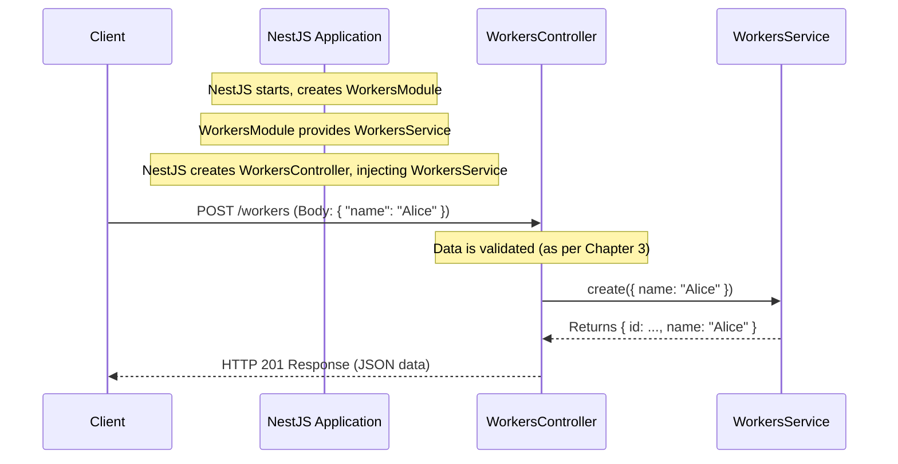

# Chapter 4: NestJS Services

Welcome back! In [Chapter 3: Data Schemas and Validation (Zod)](03_data_schemas_and_validation__zod__.md), we saw how to ensure that the data coming into our application (like a new worker's details) is correct and complete. Our [NestJS Controllers](02_nestjs_controllers_.md) receive these validated requests. But what happens next? Who actually *does the work* of, say, saving that new worker's information to a database or performing a complex calculation?

That's where **NestJS Services** step in!

## The "Doers": What Problem Do Services Solve?

Imagine our restaurant analogy again:
*   The **Customer** (client) makes a **request** (e.g., "I want to order a custom sandwich").
*   The **Host/Hostess** ([NestJS Controllers](02_nestjs_controllers_.md)) takes the order.
*   The **Order Taker** ([Data Schemas and Validation (Zod)](03_data_schemas_and_validation__zod__.md)) double-checks if the order is clear and complete (e.g., "You want rye bread, turkey, and cheddar. Got it!").

Now, who actually makes the sandwich? The host doesn't run to the kitchen to slice bread and grill the turkey. They pass the (now validated) order to the **Chef** or specialized kitchen staff.

**NestJS Services are like these skilled chefs or specialized staff.** They encapsulate the core **business logic** of your application. "Business logic" is a fancy term for the actual operations and rules that define what your application does. This includes:
*   Processing data (e.g., calculating a total price).
*   Interacting with databases (e.g., saving a new user, fetching a list of products).
*   Performing complex calculations or operations.
*   Calling external services (like sending an email or fetching data from another API).

So, if a controller receives a request to create a new worker, it doesn't try to figure out how to talk to the database itself. It delegates this task to a `WorkersService`. The service knows exactly how to store that worker's information.

This separation keeps your controllers lean and focused on handling HTTP requests, while services focus on the "how-to" of your application's tasks.

## What is a NestJS Service?

In NestJS, a service is typically a simple TypeScript class that is decorated with the `@Injectable()` decorator.

*   `@Injectable()`: This decorator marks the class as a "provider" that can be managed by NestJS's Inversion of Control (IoC) container. This means NestJS can create an instance of this service (a "chef") and "inject" it (make it available) into other classes, like controllers, that need it.

Services are where you put the "brains" of your features.

## Creating and Using a Service

Let's see how we'd create and use a service to handle the creation of a new worker.

### Step 1: Defining the Service

First, we define our service class. Let's imagine a simplified `WorkersService`.

```typescript
// File: src/modules/workers/workers.service.ts (Simplified Example)
import { Injectable } from '@nestjs/common';
import { CreateWorker } from './workers.schemas'; // Data type from Zod
import { Worker } from '@prisma/client'; // Type for a worker from our database

@Injectable() // 1. Marks this class as a Service
export class WorkersService {
  // 2. A method to "create" a worker
  async create(workerData: CreateWorker): Promise<Partial<Worker>> {
    console.log("WorkersService: Preparing to create worker:", workerData.name);
    // In a real service, we'd save 'workerData' to a database here.
    // For now, let's pretend we did and return a sample worker object.
    const newWorker = { id: Date.now(), name: workerData.name };
    console.log("WorkersService: Worker prepared:", newWorker);
    return newWorker;
  }
}
```
1.  `@Injectable()`: This tells NestJS that `WorkersService` can be provided and injected elsewhere.
2.  `async create(workerData: CreateWorker): Promise<Partial<Worker>>`: This is a method within our service. It takes `workerData` (which we know is valid thanks to Zod validation in the controller) and is responsible for the logic of creating a worker.
    *   `async` and `Promise`: Service methods that involve I/O (like database operations) are often asynchronous, returning a `Promise`.
    *   `Partial<Worker>`: We're saying it will return something that looks like a `Worker` object (which would typically come from our database model), but perhaps not all fields are present yet (hence `Partial`).

This service is very simple right now. It just logs a message and returns a mock worker object. Later, we'll see how it interacts with a real database using [Prisma ORM](05_prisma_orm_.md).

### Step 2: Making the Service Available (Providing it in a Module)

Just defining the service isn't enough. We need to tell NestJS that this service is part of a [NestJS Modules](01_nestjs_modules_.md) so it can be managed and used. We do this by adding it to the `providers` array in the module definition.

Our `WorkersService` belongs to the `WorkersModule`:

```typescript
// File: src/modules/workers/workers.module.ts (Snippet)
import { Module } from '@nestjs/common';
import { WorkersController } from './workers.controller';
import { WorkersService } from './workers.service'; // 1. Import our service

@Module({
  controllers: [WorkersController],
  providers: [WorkersService], // 2. Add service to providers
})
export class WorkersModule {}
```
1.  We import the `WorkersService`.
2.  We add `WorkersService` to the `providers` array of the `@Module()` decorator. Now, NestJS knows about `WorkersService` and can create an instance of it when needed by other parts of `WorkersModule` (like `WorkersController`).

### Step 3: Using the Service in a Controller (Dependency Injection)

Now that our `WorkersService` is defined and "provided" by `WorkersModule`, our `WorkersController` can use it. This is done through **Dependency Injection**.

Think of it like this: the `WorkersController` (the host) needs a `WorkersService` (a chef). Instead of the controller trying to create a chef itself, NestJS automatically "injects" (provides) an instance of the chef to the controller when the controller is created.

This is done via the controller's `constructor`:

```typescript
// File: src/modules/workers/workers.controller.ts (Snippet)
import { Controller, Post, Body } from '@nestjs/common';
import { WorkersService } from './workers.service'; // 1. Import the service
import { CreateWorker, createWorkerSchema } from './workers.schemas';
import { ZodValidationPipe } from '../../pipes/zod-validation-pipe';

@Controller('workers')
export class WorkersController {
  // 2. Inject WorkersService via the constructor
  constructor(private readonly workersService: WorkersService) {}

  @Post()
  async create(
    @Body(new ZodValidationPipe(createWorkerSchema)) data: CreateWorker
  ): Promise<{ message: string; worker: Partial<Worker> }> {
    console.log("WorkersController: Received request to create worker:", data.name);
    // 3. Delegate the actual creation task to the service
    const newWorker = await this.workersService.create(data);
    console.log("WorkersController: Service returned worker:", newWorker);
    return { message: "Worker created successfully!", worker: newWorker };
  }
}
```
1.  We import `WorkersService`.
2.  `constructor(private readonly workersService: WorkersService)`: This is the magic of dependency injection.
    *   We declare `workersService` as a private, readonly property of `WorkersController`.
    *   We type it as `WorkersService`.
    *   When NestJS creates an instance of `WorkersController`, it sees this constructor parameter. Because `WorkersService` is `@Injectable()` and provided in `WorkersModule`, NestJS automatically creates (or reuses an existing) instance of `WorkersService` and passes it here.
    *   Now, `this.workersService` inside the controller holds a reference to the `WorkersService` instance.
3.  `const newWorker = await this.workersService.create(data);`: The controller calls the `create` method on the injected `workersService` instance, passing along the validated `data`. The controller doesn't care *how* the service creates the worker; it just trusts the service to do its job.

**What happens when a `POST /workers` request with `{ "name": "Alice" }` comes in?**
1.  Request hits `WorkersController`.
2.  `@Body(new ZodValidationPipe(createWorkerSchema)) data: CreateWorker` validates the body. Data is `{ name: "Alice" }`.
3.  The `create` method in `WorkersController` logs: `"WorkersController: Received request to create worker: Alice"`.
4.  `this.workersService.create({ name: "Alice" })` is called.
5.  Execution jumps to `WorkersService`'s `create` method.
    *   It logs: `"WorkersService: Preparing to create worker: Alice"`.
    *   It (currently) returns a mock: `{ id: <timestamp>, name: "Alice" }`.
    *   It logs: `"WorkersService: Worker prepared: { id: ..., name: 'Alice' }"`.
6.  The result (`{ id: ..., name: "Alice" }`) is returned to `WorkersController` and stored in `newWorker`.
7.  `WorkersController` logs: `"WorkersController: Service returned worker: { id: ..., name: 'Alice' }"`.
8.  The controller sends back a JSON response: `{ "message": "Worker created successfully!", "worker": { "id": ..., "name": "Alice" } }`.

## The "Behind the Scenes" of Service Usage

The process of NestJS providing the `WorkersService` to the `WorkersController` is called Dependency Injection. It's a core concept in NestJS that helps keep your code decoupled and easier to manage.

Here's a simplified view of the interaction:


NestJS manages the lifecycle of your services. You define them, declare them as providers, and then request them in the constructors of classes that need them.

## Services Interacting with Databases (A Sneak Peek)

Our simplified `WorkersService` just logged messages. In a real application, the `create` method would need to save the worker data to a database. Services are often the components that directly interact with your database layer.

In our project, we use [Prisma ORM](05_prisma_orm_.md) for database interactions. Prisma itself is exposed through another service, `PrismaService`! So, our feature services (like `WorkersService`) will *use* `PrismaService` to talk to the database.

Here's how the *actual* `create` method in `src/modules/workers/workers.service.ts` looks:

```typescript
// File: src/modules/workers/workers.service.ts (Actual create method)
import { Injectable } from "@nestjs/common";
import { type Worker } from "@prisma/client"; // Type from Prisma
import { PrismaService } from "../prisma/prisma.service"; // 1. Import PrismaService
import { CreateWorker } from "./workers.schemas";

@Injectable()
export class WorkersService {
  // 2. Inject PrismaService
  constructor(private readonly prisma: PrismaService) {}

  async create(data: CreateWorker): Promise<Worker> {
    // 3. Use PrismaService to create a worker in the database
    return await this.prisma.worker.create({ data });
  }
  // ... other methods like getById, get etc.
}
```
1.  `PrismaService` is imported. It's another injectable service, likely provided globally or by a `PrismaModule` (as seen in [Chapter 1: NestJS Modules](01_nestjs_modules_.md)).
2.  `PrismaService` is injected into `WorkersService`'s constructor, just like `WorkersService` was injected into `WorkersController`. Yes, services can depend on other services!
3.  `this.prisma.worker.create({ data })`: This is Prisma's way of saying "in the `worker` table of my database, create a new record with this `data`."

So the "chef" (`WorkersService`) uses specialized "tools" (`PrismaService`) and ingredients from the "pantry" (database) to prepare the dish (process the request).

You'll find similar structures in:
*   `src/modules/shifts/shifts.service.ts`
*   `src/modules/workplaces/workplaces.service.ts`

Each service handles the business logic for its specific feature (shifts, workplaces) and uses `PrismaService` for database operations.

## Why This Separation? The Benefits of Services

Separating business logic into services offers several advantages:

*   **Organization (Separation of Concerns):**
    *   Controllers handle HTTP specific tasks (requests, responses, status codes, headers).
    *   Services handle pure business logic, independent of HTTP.
    *   This makes your codebase cleaner and easier to understand.
*   **Reusability:** The same service method can be used by multiple controllers if needed, or even by other services. For example, a `UsersService` might be used by an `AuthService` and an `OrdersService`.
*   **Testability:** Business logic within a service can be tested in isolation, without needing to simulate HTTP requests. You can just create an instance of the service and call its methods directly in your tests.
*   **Maintainability:** If you need to change how a worker is created (e.g., add an extra step or validation), you only need to modify the `WorkersService`. The `WorkersController` doesn't need to change.
*   **Scalability:** As your application grows, clearly defined services make it easier to manage complexity.

## Conclusion

You've now learned about **NestJS Services**, the workhorses of your application!
*   They are classes decorated with `@Injectable()`.
*   They contain the core business logic (the "how-to").
*   They are "provided" within modules and "injected" into controllers (or other services) using dependency injection.
*   They promote cleaner, more organized, testable, and maintainable code by separating concerns.
*   Services often interact with databases, and in our project, they do so by using another specialized service, `PrismaService`.

We've seen that the `WorkersService` in our project relies on `PrismaService` to actually save data. This `PrismaService` is our gateway to the database. But what is Prisma, and how does it help us work with databases so easily?

In the next chapter, we'll dive into [Prisma ORM](05_prisma_orm_.md) to understand how it simplifies database interactions in our NestJS application.

---

Generated by [AI Codebase Knowledge Builder](https://github.com/The-Pocket/Tutorial-Codebase-Knowledge)