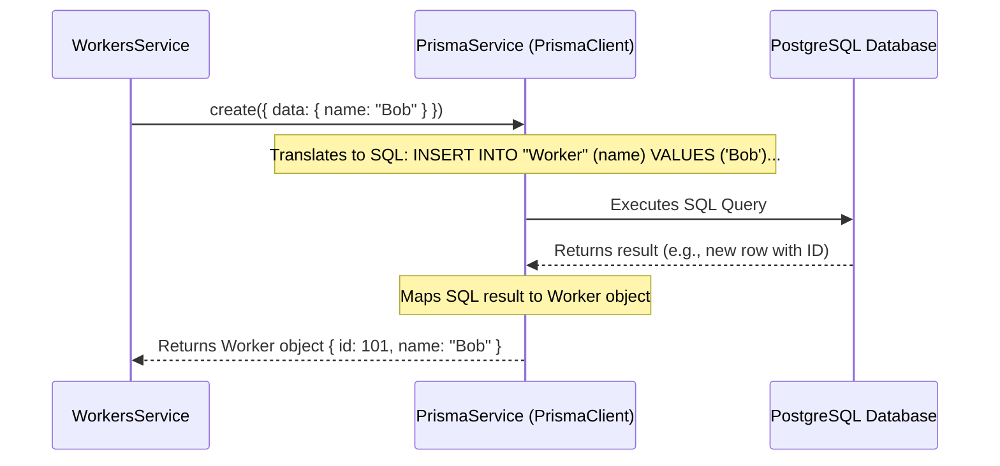

# Chapter 5: Prisma ORM

In [Chapter 4: NestJS Services](04_nestjs_services_.md), we learned that services handle the core business logic of our application. We saw an example where `WorkersService` was responsible for creating a worker. A key part of this "work" is often interacting with a database – saving new data, fetching existing data, updating it, or deleting it.

But how do we talk to a database from our TypeScript code? Do we have to write complex SQL queries manually? That can be error-prone and time-consuming. This is where **Prisma ORM** comes to our rescue!

## The Helpful Librarian: What Problem Does Prisma Solve?

Imagine your application's database is a vast, sprawling library. It contains all sorts of information (workers, shifts, workplaces) organized on different shelves and sections. Now, your `WorkersService` needs to find a specific worker's record or add a new one.

Without a librarian, your service would have to:
1.  Learn the exact layout of the library (the database's structure and tables).
2.  Learn the specific language the library uses for requests (SQL - Structured Query Language).
3.  Carefully craft a request in SQL (e.g., `SELECT * FROM workers WHERE name = 'Alice';`).
4.  Hope it didn't make any typos or logical errors in the SQL.

This is a lot of work, and if the library reorganizes, your service's instructions might break!

**Prisma ORM is like a super-efficient, multilingual librarian for your database.**
*   You tell Prisma what you want in familiar terms (TypeScript code).
*   Prisma knows the library's layout (your database schema).
*   Prisma expertly navigates the shelves (constructs and executes the correct SQL queries).
*   Prisma brings back exactly what you asked for, or stores new information, ensuring everything is consistent and even giving you auto-completion in your code editor because it understands the "shape" of your data.

Prisma is an **Object-Relational Mapper (ORM)**. This means:
*   **Object:** You work with data as JavaScript/TypeScript objects.
*   **Relational:** It connects these objects to tables in your relational database (like PostgreSQL, MySQL, SQL Server, etc.).
*   **Mapper:** It handles the translation between your objects and the database tables/rows.

Prisma simplifies database interactions by abstracting away the complexities of raw SQL, making your code cleaner, safer (type-safe!), and easier to write.

## Key Components of Prisma

For a beginner, the two most important parts of Prisma you'll interact with are:

1.  **Prisma Schema (`schema.prisma`):** This is a special file where you define your database models. Think of it as the blueprint for your library's catalog – it describes what kind of "books" (data records) you have and what information each "book" contains (fields like `name`, `id`, `email`).
2.  **Prisma Client:** This is an auto-generated TypeScript query builder. Once you define your schema, Prisma generates a custom client that provides methods to interact with your database in a type-safe way. It's like getting a personalized request form from the librarian that already knows what information you might ask for.

Let's see these in action.

### 1. Defining Your Data: The Prisma Schema

The Prisma schema file (usually `prisma/schema.prisma`) is the single source of truth for your database structure. You define your models, their fields, and their types here.

Let's look at a simplified `Worker` model from our project's `prisma/schema.prisma` file:

```prisma
// File: prisma/schema.prisma (Simplified Snippet)

datasource db {
  provider = "postgresql" // We are using PostgreSQL
  url      = env("DATABASE_URL") // Connection string from environment
}

generator client {
  provider = "prisma-client-js" // We want to generate Prisma Client for JS/TS
}

// Define a 'Worker' model
model Worker {
  id    Int     @id @default(autoincrement()) // Unique ID, auto-increments
  name  String  // Worker's name, a string
  // ... other fields like shifts, createdAt, etc.
}
```
*   `datasource db`: Configures your database connection (here, PostgreSQL).
*   `generator client`: Tells Prisma to generate the Prisma Client.
*   `model Worker { ... }`: This defines a model named `Worker`. Prisma will typically map this to a database table called `Worker` (or `workers`).
    *   `id Int @id @default(autoincrement())`: Defines an `id` field of type `Int` (integer). `@id` makes it the primary key. `@default(autoincrement())` means the database will automatically assign a new, incrementing ID for each new worker.
    *   `name String`: Defines a `name` field of type `String`.

When you make changes to this `schema.prisma` file (e.g., add a new field or a new model), you use Prisma's **migration** commands (like `npx prisma migrate dev`) to apply these changes to your actual database, keeping your database structure in sync with your schema. (We won't dive deep into migrations here, but it's good to know they exist!)

### 2. Interacting with Data: Prisma Client

Once you have your schema and run `npx prisma generate` (or it runs automatically with migrations), Prisma creates a customized `PrismaClient` for you. This client provides methods like `findUnique()`, `findMany()`, `create()`, `update()`, and `delete()` for each model you defined.

In our project, we have a dedicated `PrismaService` that initializes and provides this `PrismaClient`.

```typescript
// File: src/modules/prisma/prisma.service.ts (Simplified)
import { Injectable } from "@nestjs/common";
import { PrismaClient } from "@prisma/client"; // 1. Import generated PrismaClient

@Injectable()
export class PrismaService extends PrismaClient { // 2. Extend PrismaClient
  async onModuleInit() {
    await this.$connect(); // 3. Connect to the database
  }
}
```
1.  `import { PrismaClient } from "@prisma/client";`: This imports the `PrismaClient` that Prisma generated based on your `schema.prisma`. The `@prisma/client` path points to this generated code.
2.  `export class PrismaService extends PrismaClient`: Our `PrismaService` inherits all the functionalities of the generated `PrismaClient`.
3.  `await this.$connect();`: When our NestJS application starts, this service connects to the database.

This `PrismaService` is then made globally available by `PrismaModule`, as we saw in [Chapter 1: NestJS Modules](01_nestjs_modules_.md):

```typescript
// File: src/modules/prisma/prisma.module.ts
import { Global, Module } from "@nestjs/common";
import { PrismaService } from "./prisma.service";

@Global() // Makes PrismaService available everywhere
@Module({
  providers: [PrismaService],
  exports: [PrismaService],   // Exports PrismaService for injection
})
export class PrismaModule {}
```

## Using Prisma Client in a Service

Now, let's revisit our `WorkersService` from [Chapter 4: NestJS Services](04_nestjs_services_.md) and see how it uses the injected `PrismaService` (which *is* our Prisma Client instance) to perform database operations.

**Example: Creating a Worker**

Suppose our controller receives a request to create a new worker with the name "Bob". The controller validates the data and calls the `create` method in `WorkersService`:

```typescript
// In src/modules/workers/workers.service.ts
import { Injectable } from "@nestjs/common";
import { PrismaService } from "../prisma/prisma.service"; // Our Prisma Client access
import { CreateWorker } from "./workers.schemas"; // { name: string }
import { Worker } from "@prisma/client"; // Type for a Worker from Prisma

@Injectable()
export class WorkersService {
  constructor(private readonly prisma: PrismaService) {} // Inject PrismaService

  async create(data: CreateWorker): Promise<Worker> {
    // Use Prisma Client to create a new worker record
    const newWorker = await this.prisma.worker.create({
      data: {
        name: data.name,
        // other fields can be set here if needed
      },
    });
    return newWorker;
  }
}
```
*   `constructor(private readonly prisma: PrismaService)`: `PrismaService` is injected.
*   `await this.prisma.worker.create({ data: { name: data.name } })`: This is Prisma Client in action!
    *   `this.prisma`: Accesses our injected `PrismaService`.
    *   `.worker`: Because we have a `model Worker` in our `schema.prisma`, Prisma Client provides a `worker` property. This is type-safe! If you typed `this.prisma.worger` (a typo), TypeScript would complain.
    *   `.create()`: This is the method to create a new record.
    *   `{ data: { name: data.name } }`: We provide the data for the new worker. Prisma Client knows from the schema that `Worker` has a `name` field. Again, type-safe! If you tried to pass `name: 123` (a number), TypeScript would flag it as an error if `name` is defined as `String` in the schema.

**Output/Result:**
If `data.name` was "Bob", Prisma would execute an SQL `INSERT` query behind the scenes. If successful, `newWorker` would be an object representing the newly created worker in the database, including its auto-generated `id`:
```json
// Example newWorker object
{
  "id": 101, // Or some other auto-generated ID
  "name": "Bob"
  // ... other default fields like createdAt might also be here
}
```

**Example: Finding a Worker by ID**

```typescript
// In src/modules/workers/workers.service.ts
// ... (imports and constructor as above)

  async getById(id: number): Promise<Worker | null> {
    // Use Prisma Client to find a worker by their unique ID
    const worker = await this.prisma.worker.findUnique({
      where: { id: id }, // or just { id }
    });
    return worker; // Returns the worker object or null if not found
  }
```
*   `this.prisma.worker.findUnique({ where: { id: id } })`:
    *   `.findUnique()`: A Prisma Client method to find a single record based on a unique field (like our `id` which is `@id`).
    *   `{ where: { id: id } }`: Specifies the condition for finding the worker.

**Output/Result:**
If a worker with the given `id` exists, `worker` will be the worker object. If not, `worker` will be `null`.

You can see more Prisma Client usage in `prisma/seed.ts` where we populate the database with initial data:
```typescript
// File: prisma/seed.ts (Simplified snippet)
import { PrismaClient } from "@prisma/client";
const prisma = new PrismaClient();

async function main() {
  // Example of creating a worker
  await prisma.worker.create({
    data: { name: "Alice from Seed" },
  });
  // ... creates workplaces and shifts similarly
}
// ... main().catch().finally()
```
This script directly uses `PrismaClient` to add sample data to the database tables.

## Under the Hood: Prisma Client's Magic

When your service calls a Prisma Client method like `this.prisma.worker.create(...)`:

1.  **TypeScript Method Call:** Your NestJS service calls a well-typed TypeScript method on the `PrismaClient` instance.
2.  **Query Generation:** Prisma Client takes this method call and its arguments and internally constructs an optimized SQL query tailored for your specific database (e.g., PostgreSQL). It knows how to do this because it was generated based on your `schema.prisma` and your database provider.
3.  **Database Execution:** Prisma Client sends this SQL query to your database server for execution.
4.  **Result Mapping:** The database sends back the results (e.g., the newly inserted row, or rows from a `SELECT` query).
5.  **Object Conversion:** Prisma Client takes these raw database results and "maps" them back into JavaScript objects that match the types defined in your `schema.prisma` (and thus, the types TypeScript expects).
6.  **Return to Service:** The typed JavaScript objects are returned to your service method.

Here's a simplified sequence:



This entire process means you, the developer, get to work with familiar TypeScript objects and methods, and Prisma handles all the complex and error-prone SQL interactions.

## Benefits of Using Prisma

*   **Type Safety:** This is a huge win! Prisma Client is fully type-safe. If you try to query a field that doesn't exist or provide the wrong type of data, your TypeScript compiler will catch it *before* you even run your code. This drastically reduces runtime errors.
*   **Auto-completion:** Because Prisma Client is generated and typed, your code editor can provide excellent auto-completion for model names, fields, and query options.
*   **Readability:** Prisma queries are often more readable and easier to understand than complex SQL strings embedded in your code.
*   **Less Boilerplate:** No need to manually write connection logic, statement preparation, or result set mapping for common operations.
*   **Migrations:** Prisma's migration system helps you evolve your database schema predictably and safely.
*   **Developer Productivity:** Faster development due to the above benefits.

## Conclusion

You've now been introduced to **Prisma ORM**, our powerful "librarian" for database interactions!
We've learned that:
*   Prisma simplifies talking to databases by letting us use TypeScript objects and methods instead of writing raw SQL.
*   The **Prisma Schema (`schema.prisma`)** defines our data models, acting as the blueprint.
*   **Prisma Client** is an auto-generated, type-safe query builder that provides methods like `create`, `findUnique`, `findMany`, etc., for each model.
*   In our project, `PrismaService` makes `PrismaClient` available for injection into other services like `WorkersService`.
*   Prisma offers significant benefits in type safety, auto-completion, and developer productivity.

With Prisma handling our database communication, our services can now reliably fetch and store the data they need. Often, when we fetch lists of data (like a list of all available shifts or all workers), we might get back a lot of records. Displaying hundreds or thousands of items at once isn't user-friendly. We need a way to show data in manageable chunks or "pages."

In the next chapter, we'll explore how to build a [Pagination System](06_pagination_system_.md) on top of our Prisma data-fetching capabilities to handle large datasets gracefully.

---

Generated by [AI Codebase Knowledge Builder](https://github.com/The-Pocket/Tutorial-Codebase-Knowledge)