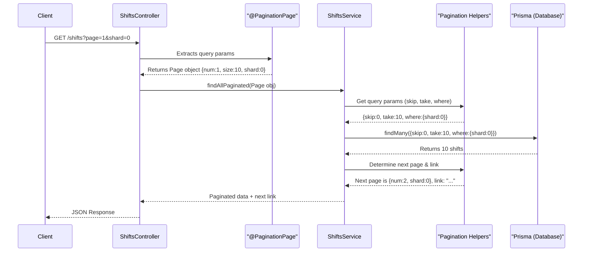

# Chapter 6: Pagination System

Welcome back! In [Chapter 5: Prisma ORM](05_prisma_orm_.md), we saw how Prisma acts as our helpful "librarian," making it easy for our [NestJS Services](04_nestjs_services_.md) to talk to the database. Our services can now fetch lists of workers, shifts, or workplaces. But what happens if we have thousands, or even millions, of shifts in our database? If Prisma fetches all of them at once and our service tries to send them all to the user, the application could become very slow, and the user would be overwhelmed with too much data!

This is where our **Pagination System** comes in.

## The Problem: The Never-Ending List

Imagine you're building an application to display available work shifts. If there are 5,000 shifts available, trying to load and show all 5,000 on a single webpage would be a nightmare:
*   **Slow Performance:** Fetching and sending that much data takes time. The user would be staring at a loading screen.
*   **Bad User Experience:** Who wants to scroll through thousands of items? It's hard to find anything.

It's like being handed an incredibly long scroll instead of a book. A book is divided into pages, making it easy to read and navigate. We need a similar system for our data.

The **Pagination System** solves this by breaking down large datasets into smaller, manageable chunks called "pages." Instead of showing all 5,000 shifts, we might show 10 shifts on "Page 1," another 10 on "Page 2," and so on. This makes our application faster and much more user-friendly.

## Key Concepts of Our Pagination System

Our pagination system has a few core ideas, similar to reading a multi-volume encyclopedia:

1.  **Pages**: Each "page" is a small, fixed-size chunk of data. For example, a page might contain 10 shifts.
2.  **Page Size**: This is how many items appear on a single page. In our system, we've set a default `PAGE_SIZE` (e.g., 10 items per page).
    ```typescript
    // From: src/modules/shared/pagination.ts
    const PAGE_SIZE = 10;
    ```
3.  **Page Number**: This tells us which specific chunk of data we're looking at. Page 1, Page 2, etc. By default, we start at `FIRST_PAGE` (which is 1).
    ```typescript
    // From: src/modules/shared/pagination.ts
    const FIRST_PAGE = 1;
    ```
4.  **Sharding: Multiple Volumes of the Book**:
    Imagine your encyclopedia is so large it's split into multiple volumes (Volume A-C, Volume D-F, etc.). This is "sharding." In our system, data can be divided into different "shards." A shard is like a big section or partition of your total data.
    *   Pagination first happens *within* a shard. So, you'd read Page 1 of Volume A-C, then Page 2 of Volume A-C, etc.
    *   Once you finish all pages in one shard (Volume A-C), you move to the first page of the next shard (Volume D-F).
    *   We have a `DEFAULT_SHARD` (usually 0) and a `MAX_SHARDS` limit (e.g., 10, meaning shards 0 through 9).
    ```typescript
    // From: src/modules/shared/pagination.ts
    const DEFAULT_SHARD = 0;
    // From: src/modules/shared/constants.ts
    // export const MAX_SHARDS = 10; // (Example value)
    ```
    Sharding helps manage truly massive datasets by breaking them into even more manageable, potentially separate, segments. For many typical applications, you might operate within a single shard (shard 0) for a long time.

5.  **Navigation**: To move from one page to the next, the system provides a "next" link. This tells the user (or their browser) how to request the subsequent page of data.

## Using Pagination: Requesting a Page of Data

When a client (like a web browser or our [API Client Script (Top Workplaces)](07_api_client_script__top_workplaces_.md)) wants to get a list of items (e.g., shifts), it can specify which page and shard it's interested in using query parameters in the URL:

`GET /shifts?page=2&shard=0`

This request asks for:
*   Page number `2`
*   From shard `0`

If `page` or `shard` are not provided, our system will use default values (e.g., page 1, shard 0).

### In the Controller: Getting Page Information

Our [NestJS Controllers](02_nestjs_controllers_.md) need to understand these `page` and `shard` query parameters. We use a custom NestJS decorator called `@PaginationPage` to easily extract this information.

```typescript
// Example usage in a ShiftsController
import { Controller, Get } from '@nestjs/common';
import { ShiftsService } from './shifts.service';
import { PaginationPage } from '../shared/pagination'; // Our custom decorator
import { Page } from '../shared/shared.types'; // Type for page info

@Controller('shifts')
export class ShiftsController {
  constructor(private readonly shiftsService: ShiftsService) {}

  @Get() // Handles GET /shifts?page=...&shard=...
  async getAllShifts(@PaginationPage() page: Page) {
    // 'page' will be an object like { num: 2, size: 10, shard: 0 }
    // It's populated by the @PaginationPage decorator
    return this.shiftsService.findAllPaginated(page);
  }
}
```
The `@PaginationPage()` decorator (defined in `src/modules/shared/pagination.ts`) reads the `page` and `shard` from the request's query parameters and bundles them into a `Page` object.

### In the Service: Fetching Paginated Data

The controller then passes this `Page` object to a method in the [NestJS Service](04_nestjs_services_.md), like `findAllPaginated(page)`. The service is responsible for:
1.  Calculating how many records to `skip` and how many to `take` for the database query, based on the `page.num`, `page.size`, and `page.shard`.
2.  Fetching the actual data for that page using [Prisma ORM](05_prisma_orm_.md).
3.  Determining if there's a "next page" (and what its page number and shard would be).
4.  Returning the data for the current page and information about the next page.

### The API Response

A paginated API endpoint typically returns two main things:
1.  The `data` for the current page.
2.  `links` which may include a `next` URL to fetch the next page.

Our `PaginatedResponse` type in `src/modules/shared/shared.types.ts` defines this:
```typescript
// File: src/modules/shared/shared.types.ts
export interface PaginatedResponse<T> {
  data: T[]; // Array of items for the current page
  links: { next?: string }; // URL for the next page, if it exists
}
```
So, a response for `GET /shifts?page=1&shard=0` might look like:
```json
{
  "data": [
    { "id": 1, "title": "Morning Shift at Cafe" /* ... */ },
    // ... 9 more shift objects ...
  ],
  "links": {
    "next": "http://localhost:3000/shifts?page=2&shard=0"
  }
}
```

## How It Works: The Journey of a Paginated Request

Let's trace what happens when a client requests `GET /shifts?page=1&shard=0`:

1.  **Client Request**: Browser sends `GET /shifts?page=1&shard=0`.
2.  **Controller Receives**: `ShiftsController`'s `getAllShifts` method is triggered.
3.  **Decorator Extracts**: The `@PaginationPage()` decorator reads `page=1` and `shard=0` from the URL. It creates a `Page` object like `{ num: 1, size: 10, shard: 0 }`.
4.  **Service Call**: The controller calls `shiftsService.findAllPaginated({ num: 1, size: 10, shard: 0 })`.
5.  **Service Logic (Query Prep)**:
    *   The service uses helper functions from `src/modules/shared/pagination.ts` to calculate database query parameters. For page 1, size 10, shard 0:
        *   `skip` = (1 - 1) * 10 = 0 (skip 0 records)
        *   `take` = 10 (fetch 10 records)
        *   `where` condition will include `shard: 0`.
6.  **Database Query**: The service uses Prisma to fetch data: `prisma.shift.findMany({ skip: 0, take: 10, where: { shard: 0 } })`.
7.  **Next Page Logic**: The service then checks if there's a next page.
    *   It first sees if there are more items on page 2 of shard 0.
    *   If not, it checks if shard 1 exists and has items on its page 1.
    *   Let's say page 2 of shard 0 exists. The next page is `{ num: 2, size: 10, shard: 0 }`.
8.  **Construct Next Link**: The service (or a helper) creates the URL for the next page: `http://localhost:3000/shifts?page=2&shard=0`.
9.  **Service Returns**: The service returns an object containing the 10 shifts fetched and the next page link.
10. **Controller Responds**: The controller sends this back to the client as JSON.

Here's a simplified diagram:


## Under the Hood: A Look at `src/modules/shared/pagination.ts`

The file `src/modules/shared/pagination.ts` contains the core logic for our pagination system. Let's look at a few key functions:

### `getPage(pageNum?: number, shard?: number): Page`
This function takes optional `pageNum` and `shard` (as read from URL query parameters) and ensures we always have valid values, applying defaults if necessary.

```typescript
// File: src/modules/shared/pagination.ts (Simplified)
const FIRST_PAGE = 1;
const PAGE_SIZE = 10;
// const DEFAULT_SHARD = 0; // Defined elsewhere but used conceptually

export function getPage(pageNum?: number, shard?: number): Page {
  return {
    num: pageNum ? pageNum : FIRST_PAGE, // Default to page 1
    size: PAGE_SIZE,                     // Fixed page size
    shard: shard,                        // Use provided shard, or undefined
  };
}
```
If a user requests `/shifts` (no `page` or `shard`), `pageNum` and `shard` will be `undefined`. `getPage()` would then return `{ num: 1, size: 10, shard: undefined }`. The `shard` being `undefined` here is then typically handled by `queryParameters` to use `DEFAULT_SHARD`.

### `queryParameters({ page: Page })`
This function is vital. It translates our `Page` object into parameters that Prisma can understand for fetching the correct slice of data.

```typescript
// File: src/modules/shared/pagination.ts (Simplified)
const DEFAULT_SHARD = 0;

export function queryParameters(parameters: { page: Page }): {
  skip: number;
  take: number;
  where: { shard: number };
} {
  const { page } = parameters;
  return {
    take: page.size, // How many items to fetch
    skip: (page.num - 1) * page.size, // How many items to skip (offset)
                                      // (page.num is 1-indexed)
    where: { shard: page.shard ?? DEFAULT_SHARD }, // Filter by shard
  };
}
```
*   `take`: Always our fixed `page.size`.
*   `skip`: Calculates the offset. For page 1, skip 0. For page 2, skip `page.size` items.
*   `where: { shard: ... }`: Ensures Prisma only looks at data within the specified shard. If `page.shard` wasn't provided, it defaults to `DEFAULT_SHARD`.

### `getNextPage({ currentPage: Page, collection: CountableCollection })`
This is the brain behind figuring out if a "next page" exists and what it is. It's a bit more complex because it handles shard transitions.

```typescript
// File: src/modules/shared/pagination.ts (Simplified Conceptual Flow)
// CountableCollection is an abstraction for something Prisma can count, like prisma.shift
async function countOnPage(page: Page, collection: CountableCollection): Promise<number> {
  // Uses collection.count(queryParameters({ page })) to see how many items
  // would be on 'page'. Simplified for brevity.
  return collection.count(queryParameters({ page }));
}

export async function getNextPage(parameters: {
  currentPage: Page;
  collection: CountableCollection; // e.g., prisma.shift
}): Promise<Page | undefined> {
  const { currentPage, collection } = parameters;

  // 1. Try next page in current shard
  const nextPageNumInCurrentShard = currentPage.num + 1;
  const potentialNextPageInShard = getPage(nextPageNumInCurrentShard, currentPage.shard);
  if (await countOnPage(potentialNextPageInShard, collection) > 0) {
    return potentialNextPageInShard; // Found items, this is the next page
  }

  // 2. If no more in current shard, try first page of next shard
  const nextShardNum = (currentPage.shard ?? DEFAULT_SHARD) + 1;
  if (nextShardNum > MAX_SHARDS) { // MAX_SHARDS from constants.ts
    return undefined; // No more shards
  }

  const potentialPageInNextShard = getPage(FIRST_PAGE, nextShardNum);
  if (await countOnPage(potentialPageInNextShard, collection) > 0) {
    return potentialPageInNextShard; // Found items in next shard
  }

  return undefined; // No more pages anywhere
}
```
The `CountableCollection` (like `prisma.shift` or `prisma.worker`) allows this generic function to ask the database, "How many items exist for this potential next page (considering its shard)?"
1.  It first checks if there's a subsequent page within the `currentPage.shard`.
2.  If not, it increments the shard number and checks for the `FIRST_PAGE` in that `nextShardNum`.
3.  If it runs out of shards (goes beyond `MAX_SHARDS`) or finds no items, it returns `undefined`, meaning no next page.

### `nextLink({ nextPage?: Page, request: Request })`
If `getNextPage` finds a `nextPage`, this function constructs the full URL for it.

```typescript
// File: src/modules/shared/pagination.ts (Simplified)
// Assume urlWithoutQueryParameters(request) gets base URL e.g., "http://.../shifts"
// Assume PAGE_QUERY_PARAM = "page", SHARD_QUERY_PARAM = "shard"

export function nextLink(parameters: {
  nextPage?: Page; // The Page object for the next page
  request: Request; // The original Express request object
}): string | undefined {
  const { nextPage, request } = parameters;
  if (!nextPage) {
    return undefined;
  }
  // Simplified: constructs "http://.../shifts?page=X&shard=Y"
  const base = urlWithoutQueryParameters(request);
  let query = `${PAGE_QUERY_PARAM}=${nextPage.num}`;
  if (nextPage.shard !== undefined) { // Only add shard if it's defined
    query += `&${SHARD_QUERY_PARAM}=${nextPage.shard}`;
  }
  return `${base}?${query}`;
}
```

### The `@PaginationPage` Decorator
This custom decorator, mentioned earlier, neatly ties into NestJS's request handling.

```typescript
// File: src/modules/shared/pagination.ts
import { createParamDecorator, ExecutionContext } from "@nestjs/common";
// ... other imports like Request, getPage, parseOptionalInt ...
const PAGE_QUERY_PARAM = "page";
const SHARD_QUERY_PARAM = "shard";

// Helper to parse string query param to int or undefined
function parseOptionalInt(value?: string): number | undefined {
  return value ? parseInt(value, 10) : undefined;
}

export const PaginationPage = createParamDecorator(
  (_data: unknown, ctx: ExecutionContext) => {
    const request: Request = ctx.switchToHttp().getRequest();
    const pageQuery = request.query[PAGE_QUERY_PARAM] as string | undefined;
    const shardQuery = request.query[SHARD_QUERY_PARAM] as string | undefined;

    const pageNum = parseOptionalInt(pageQuery);
    const shardNum = parseOptionalInt(shardQuery);

    return getPage(pageNum, shardNum); // Use our getPage helper
  },
);
```
It extracts the `page` and `shard` strings from the URL query, parses them into numbers, and then uses `getPage()` to create the structured `Page` object that gets injected into your controller method.

## Conclusion

You've now learned about our **Pagination System**! It's a crucial feature for any application that deals with potentially large lists of data.
We've seen that:
*   Pagination breaks data into smaller, user-friendly "pages."
*   It improves performance by reducing the amount of data transferred at once.
*   Our system uses page numbers, page sizes, and even "shards" (like volumes of a book) to manage data.
*   Clients request specific pages via URL query parameters (`?page=...&shard=...`).
*   The `@PaginationPage` decorator helps controllers extract this information.
*   Helper functions in `src/modules/shared/pagination.ts` calculate Prisma query parameters (`skip`, `take`, `where.shard`) and determine "next page" links, handling transitions across shards.
*   The API responds with the current page's data and a link to the next page, if available.

This system ensures that even if our application stores a vast amount of information (like shifts, workers, or workplaces), users can browse it efficiently.

Now that we have APIs that can serve data (and serve it in paginated chunks!), how would another program or script interact with these APIs? In the next chapter, we'll look at an example: [API Client Script (Top Workplaces)](07_api_client_script__top_workplaces_.md), which will consume the API we've been building.

---

Generated by [AI Codebase Knowledge Builder](https://github.com/The-Pocket/Tutorial-Codebase-Knowledge)