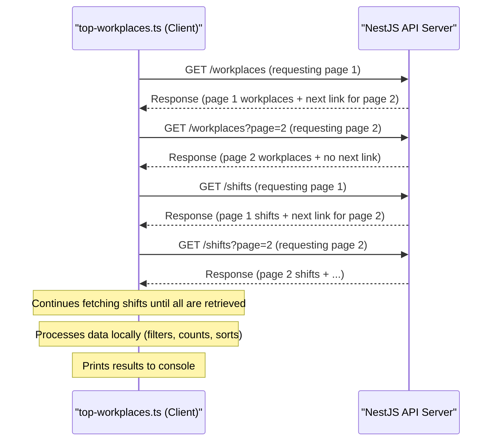

# Chapter 7: API Client Script (Top Workplaces)

Welcome to the final chapter! In [Chapter 6: Pagination System](06_pagination_system_.md), we learned how our API can serve large amounts of data in manageable, paginated chunks. We built an API that provides information about workplaces, workers, and shifts. But how would another program or script actually *use* this API to get data and do something useful with it?

That's what this chapter is all about. We'll explore a script called `top-workplaces.ts`. This script acts like an external client (think of it as a curious data analyst) that wants to connect to our application's API, gather some information, and perform an analysis.

## The Data Analyst's Mission: Finding Top Performers

Imagine you're a data analyst working for "Red Planet Staffing." Your manager asks you: "Can you find out which of our active workplaces have completed the most shifts? I want to see the top 3."

To answer this, the data analyst (our script) needs to:
1.  Get a list of all workplaces from our API.
2.  Get a list of all shifts from our API.
3.  Figure out which workplaces are "active."
4.  For each active workplace, count how many of its shifts were actually "completed" (meaning a worker was assigned and the shift wasn't cancelled).
5.  Sort the workplaces by this count and pick the top 3.
6.  Present this report.

The `top-workplaces.ts` script automates this entire process by "talking" to our application's API. It demonstrates how a completely separate program can consume the services (API endpoints) we've built.

## What is `top-workplaces.ts`?

The `top-workplaces.ts` script is a standalone TypeScript program located in the `src/scripts/` directory of our project. It's not part of the NestJS application server itself. Instead, it runs independently and makes HTTP requests to our NestJS API, just like a web browser or any other external application would.

Think of our NestJS application as a company offering public services (the API endpoints). The `top-workplaces.ts` script is like a customer or a data analyst using those public services to get information, analyze it, and then present a report (which, in this case, is output to the console).

## Key Tasks of Our "Data Analyst" Script

To accomplish its mission, the script performs several key tasks:

1.  **Fetching Data from the API**: It needs to retrieve all workplace records and all shift records. Since our API uses pagination (as discussed in [Chapter 6: Pagination System](06_pagination_system_.md)), the script needs to be smart enough to fetch page after page until it has all the data.
2.  **Understanding the Data's Shape**: The script defines TypeScript interfaces (like `Workplace` and `Shift`) to understand the structure of the JSON data it receives from the API.
3.  **Filtering Data**: It filters the list of workplaces to find only the "active" ones.
4.  **Analyzing Data**: It processes the shifts data to count how many completed shifts belong to each active workplace.
5.  **Presenting Results**: It sorts the workplaces by their completed shift count and prints the top performers to the console in a specific format.

Let's look at how it does these things.

### 1. The API's Address

First, the script needs to know where our API is running. It defines a base URL:

```typescript
// File: src/scripts/top-workplaces.ts (Snippet)
const API_URL = 'http://localhost:3000';
```
This tells the script that our API can be reached at `http://localhost:3000`. All requests for workplaces, shifts, etc., will be made to this base address (e.g., `http://localhost:3000/workplaces`).

### 2. Understanding the API's Language (Data Structures)

When the script gets data from the API, it arrives as JSON. To work with this data easily in TypeScript, the script defines interfaces that match the expected structure.

For a workplace:
```typescript
// File: src/scripts/top-workplaces.ts (Snippet)
interface Workplace {
  id: number;
  name: string;
  status: number; // 0=ACTIVE, 1=SUSPENDED, 2=CLOSED
}
```
This `Workplace` interface tells the script to expect an `id` (number), a `name` (string), and a `status` (number) for each workplace record.

For a shift:
```typescript
// File: src/scripts/top-workplaces.ts (Snippet)
interface Shift {
  id: number;
  startAt: string;
  endAt: string;
  workplaceId: number;
  workerId: number | null;
  cancelledAt: string | null;
}
```
This `Shift` interface describes the fields the script expects for shift data, like `workplaceId` (to link it to a workplace), `workerId` (to see if it's claimed), and `cancelledAt` (to see if it was cancelled).

And for the API's paginated response:
```typescript
// File: src/scripts/top-workplaces.ts (Snippet)
interface ApiResponse<T> {
  data: T; // The actual data items (e.g., an array of Workplaces)
  links?: {
    next?: string; // URL for the next page, if any
  };
}
```
This `ApiResponse<T>` interface helps the script understand the paginated structure we learned about in [Chapter 6: Pagination System](06_pagination_system_.md), especially the `links.next` part for fetching subsequent pages.

### 3. Fetching All Data (Dealing with Pagination)

Our API endpoints like `/workplaces` and `/shifts` return paginated data. The script can't just ask for `/workplaces` once and expect to get everything if there are many workplaces. It needs to keep asking for the "next" page until there are no more pages.

The script has functions like `fetchAllWorkplaces` and `fetchAllShifts` to handle this. Let's look at a simplified `fetchAllWorkplaces`:

```typescript
// File: src/scripts/top-workplaces.ts (Simplified fetchAllWorkplaces)
async function fetchAllWorkplaces(): Promise<Workplace[]> {
  let url = `${API_URL}/workplaces`; // Start with the first page
  const allWorkplaces: Workplace[] = [];

  while (url) { // Keep fetching as long as there's a next URL
    const response = await fetch(url); // Make HTTP GET request
    const pageData = await response.json() as ApiResponse<Workplace[]>;
    allWorkplaces.push(...pageData.data); // Add current page's data
    
    url = pageData.links?.next || ''; // Get URL for next page, or empty to stop
  }
  return allWorkplaces;
}
```
*   It starts with the base URL for workplaces.
*   The `while (url)` loop continues as long as there's a `url` to fetch (initially, the first page's URL, then subsequent `next` links).
*   `await fetch(url)`: This is the standard browser/Node.js way to make an HTTP request. Our script is acting like a mini-browser here.
*   `pageData.data`: Extracts the array of workplaces from the current page.
*   `url = pageData.links?.next || ''`: This is crucial! It checks if the API response includes a `links.next` URL. If yes, `url` is updated to this new URL, and the loop continues to fetch the next page. If not, `url` becomes an empty string, and the loop stops.

The `fetchAllShifts` function works in exactly the same way but uses the `/shifts` endpoint.

### 4. The Main Logic: `getTopWorkplaces()`

This is where the "data analysis" happens. Let's break down its steps:

**Step 1: Get All Raw Data**
```typescript
// File: src/scripts/top-workplaces.ts (Snippet from getTopWorkplaces)
const workplaces = await fetchAllWorkplaces();
const shifts = await fetchAllShifts();
```
First, it calls the functions we just discussed to get all workplace and shift records from our API.

**Step 2: Filter for Active Workplaces**
The analyst only cares about active workplaces. The `Workplace` interface tells us `status: 0` means "ACTIVE".
```typescript
// File: src/scripts/top-workplaces.ts (Snippet)
const activeWorkplaces = workplaces.filter(wp => wp.status === 0);
```
This line uses the JavaScript `filter` method to create a new array containing only those workplaces where `status` is `0`.

**Step 3: Count Completed Shifts for Each Active Workplace**
This is the core calculation. For each `activeWorkplace`, the script needs to look through `allShifts` and count how many belong to it and were completed.
A shift is "completed" if:
*   It's associated with the current workplace (`shift.workplaceId === workplace.id`).
*   A worker has claimed it (`shift.workerId !== null`).
*   It has not been cancelled (`shift.cancelledAt === null`).

```typescript
// File: src/scripts/top-workplaces.ts (Snippet - conceptual)
const workplaceActivity = activeWorkplaces.map(workplace => {
  const completedShifts = shifts.filter(shift => 
    shift.workplaceId === workplace.id && 
    shift.workerId !== null && 
    shift.cancelledAt === null
  ).length; // .length gives us the count

  return { name: workplace.name, shifts: completedShifts };
});
```
This `map` operation transforms each `workplace` object into a new object containing its `name` and the `shifts` (count of completed shifts).

**Step 4: Sort and Select Top 3**
Now, `workplaceActivity` is an array like `[{ name: "Mars Cafe", shifts: 50 }, { name: "Lunar Logistics", shifts: 75 }, ...]`. We need to sort it by `shifts` in descending order and take the first three.

```typescript
// File: src/scripts/top-workplaces.ts (Snippet)
workplaceActivity.sort((a, b) => b.shifts - a.shifts); // Sort descending
const topWorkplaces = workplaceActivity.slice(0, 3); // Get first 3
```

**Step 5: Print the Results**
Finally, the script prints the `topWorkplaces` to the console in a specific JSON-like format.

```typescript
// File: src/scripts/top-workplaces.ts (Snippet)
console.log('[');
topWorkplaces.forEach((wp, idx) => {
  const comma = idx < topWorkplaces.length - 1 ? ',' : '';
  console.log(`  { name: "${wp.name}", shifts: ${wp.shifts} }${comma}`);
});
console.log(']');
```
If "Lunar Logistics" had 75 shifts, "Mars Cafe" had 50, and "Red Rock Diner" had 40, the output would look like:
```
[
  { name: "Lunar Logistics", shifts: 75 },
  { name: "Mars Cafe", shifts: 50 },
  { name: "Red Rock Diner", shifts: 40 }
]
```

## How the Script Interacts with Our API

The `top-workplaces.ts` script only knows about the *public face* of our application: the API endpoints. It doesn't know or care about [NestJS Controllers](02_nestjs_controllers_.md), [NestJS Services](04_nestjs_services_.md), or [Prisma ORM](05_prisma_orm_.md) running on the server. It just sends HTTP requests and receives HTTP responses.

Here's a simplified view of the interaction:


This diagram shows the script (our "data analyst") making a series of requests to the API server. The API server, internally, uses all the components we've learned about (controllers, services, Prisma, pagination logic) to fulfill these requests. The script simply consumes the results.

## Why is This Script Important?

The `top-workplaces.ts` script demonstrates several key concepts:
*   **API Consumption**: It's a practical example of how an external client can use your API.
*   **Decoupling**: The script is completely separate from the API server. They can be developed, deployed, and scaled independently.
*   **Automation**: It automates a data analysis task that might otherwise be done manually.
*   **Real-World Use Case**: Many applications need to fetch data from other services via APIs to perform their functions. This script simulates such an interaction.

## Conclusion

Congratulations on completing this journey through the "Red Planet Staffing" project!

In this chapter, we explored the `top-workplaces.ts` script, which acts as an external API client. We saw how it:
*   Connects to our application's API endpoints.
*   Understands the API's data structures.
*   Handles pagination to fetch all necessary data (workplaces and shifts).
*   Filters and analyzes this data to find active workplaces and count their completed shifts.
*   Presents a report of the top-performing workplaces.

This script showcases the power and utility of having a well-defined API. It allows other programs and services to interact with your application's data and functionality in a structured way.

Throughout these chapters, we've covered:
1.  [NestJS Modules](01_nestjs_modules_.md) for organizing our application.
2.  [NestJS Controllers](02_nestjs_controllers_.md) for handling incoming requests.
3.  [Data Schemas and Validation (Zod)](03_data_schemas_and_validation__zod__.md) for ensuring data integrity.
4.  [NestJS Services](04_nestjs_services_.md) for implementing business logic.
5.  [Prisma ORM](05_prisma_orm_.md) for simplified database interactions.
6.  [Pagination System](06_pagination_system_.md) for handling large datasets gracefully.
7.  And finally, an **API Client Script** to demonstrate how our API can be consumed.

You now have a solid overview of the key architectural pieces that make up this NestJS application. We hope this tutorial has been a helpful and beginner-friendly introduction to these concepts! Happy coding on your own NestJS adventures!

---

Generated by [AI Codebase Knowledge Builder](https://github.com/The-Pocket/Tutorial-Codebase-Knowledge)