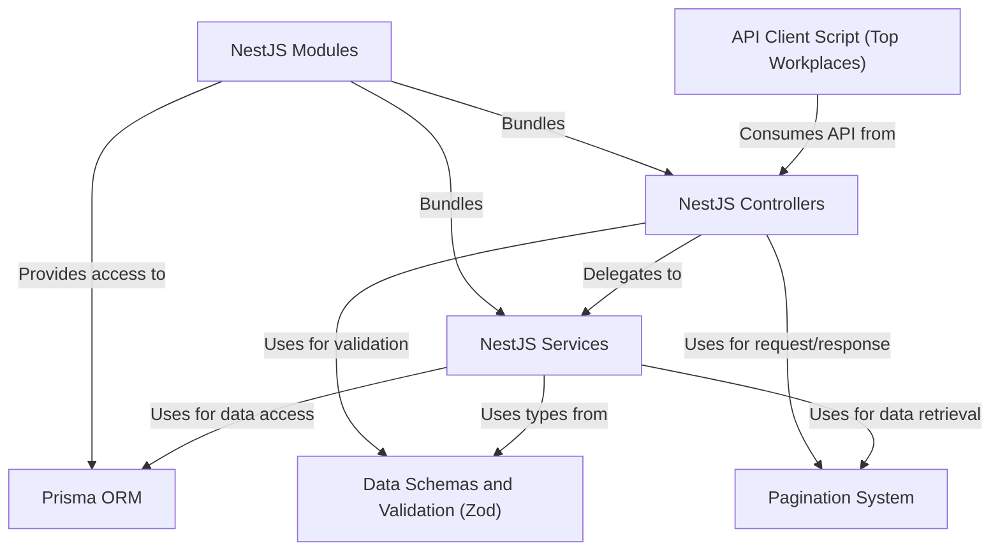

# Tutorial: 

This project, **Red Planet Staffing**, is a *backend microservice* for a Martian staffing marketplace. It helps connect **workplaces** needing temporary staff with **workers** looking for shifts. The system allows for creating and managing these *entities (workers, workplaces, shifts)*, handling *shift claims*, and *cancellations*. It's built using **NestJS** for the overall structure, **Prisma** for database interactions, and **Zod** for ensuring data is correct. It also includes a **pagination system** for handling large lists of data efficiently. A sample *API client script* demonstrates how to retrieve data, such as finding the **top-performing workplaces**.

**Source Repository:** [https://github.com/cedricmatalog/red-planet/](https://github.com/cedricmatalog/red-planet/)

## Chapters

1. [NestJS Modules
](01_nestjs_modules_.md)
2. [NestJS Controllers
](02_nestjs_controllers_.md)
3. [Data Schemas and Validation (Zod)
](03_data_schemas_and_validation__zod__.md)
4. [NestJS Services
](04_nestjs_services_.md)
5. [Prisma ORM
](05_prisma_orm_.md)
6. [Pagination System
](06_pagination_system_.md)
7. [API Client Script (Top Workplaces)
](07_api_client_script__top_workplaces__.md)

---

Generated by [AI Codebase Knowledge Builder](https://github.com/The-Pocket/Tutorial-Codebase-Knowledge)